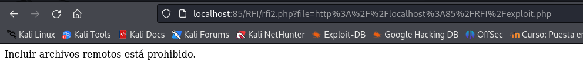
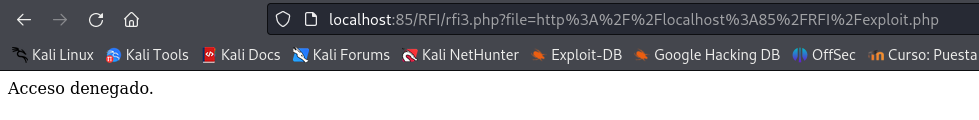

# Explotación y mitigación de RFI

## Indice

> 1. [Explotación de RFI](#explotación-de-rfi)  
> 2. [Mitigación de RFI](#mitigación-de-rfi)  
>    2.1 [Bloquear la inclusión de URLs externas](#bloquear-la-inclusión-de-urls-externas)  
>    2.2 [Restringir las rutas de inclusión](#restringir-las-rutas-de-inclusión)  
>    2.3 [Usar rutas absolutas y sanitización](#usar-rutas-absolutas-y-sanitización)  
>    2.4 [Deshabilitar allow_url_include en php.ini](#deshabilitar-allow_url_include-en-phpini)  

## Explotación de RFI

Antes de comenzar con la explotación de RFI necesitamos configurar el archivo *php.ini* para deshabilitar la seguridad, debe quedar asi:

Después debemos reiniciar el servicio con el siguiente comando:
` docker-compose restart webserver `

Creamos un archivo [rfi.php](./Recursos/rfi.php) al cual le tenemos que indicar un fichero a subir al servidor:

Para comprobar la explotación de RFI vamos a crear un archivo malicioso *exploit.php* en un servidor controlado por el atacante.

En el fichero *rfi.php* escribimos la ruta al fichero de *exploit.php*, que de momento solo mostrará un mensaje:

Posibles efectos del ataque:

- Acceso no autorizado al servidor.

- Robo de datos sensibles.

- Modificación o eliminación de archivos del sistema.

- Instalación de malware o puertas traseras (backdoors).

## Mitigación de RFI

La solución más efectiva para eliminar las vulnerabilidades de inclusión de archivos es evitar pasar la entrada enviada por el usuario a cualquier API de sistema de archivos/marco. Si esto no es posible, la aplicación puede mantener una lista de permisos de archivos que puede incluir la página y, a continuación, utilizar un identificador (por ejemplo, el número de índice) para acceder al archivo seleccionado. Cualquier solicitud que contenga un identificador no válido debe rechazarse para que no haya oportunidad de que los usuarios maliciosos manipulen la ruta.

### Bloquear la inclusión de URLs externas

Creamos el fichero [rfi2.php](./Recursos/rfi2.php) para que en lugar de permitir cualquier entrada sin validación, se debe bloquear la inclusión de archivos remotos:

Ahora sin intentamos introducir una url no nos deja y sale lo siguiente:

### Restringir las rutas de inclusión

La siguiente aproximación, sería crear un fichero [rfi3.php](./Recursos/rfi3.php) para limitar la inclusión de archivos solo a una lista de archivos específicos dentro del servidor, en este caso solo nos permite el acceso a **file1.php** y a **file2.php**.:

### Usar rutas absolutas y sanitización

Podemos ir un paso más allá asegurándonos que solo se incluyan archivos desde una ubicación específica, en este caso el mismo directorio que el script, para ello creamos el fichero [rfi4.php](./Recursos/rfi4.php) con las mitigaciones:

Si intentamos incluir un fichero que no este en la misma ruta dará acceso denegado.

### Deshabilitar allow_url_include en php.ini

Para prevenir la inclusión remota de archivos en PHP podemos configurar el servidor para que acepte únicamente archivos locales y no archivos remotos.

Esto, como hemos visto anteriormente se hace configurando la variable allow_url_include en el archivo php.ini. Esta opción previene ataques RFI globalmente.

