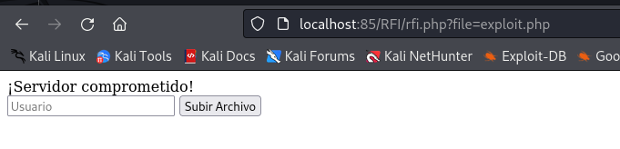

# Explotación y mitigación de RFI

## Indice

> 1. [Explotación de RFI](#explotación-de-rfi)  
> 2. [Mitigación de RFI](#mitigación-de-rfi)  
>    2.1 [Bloquear la inclusión de URLs externas](#bloquear-la-inclusión-de-urls-externas)  
>    2.2 [Restringir las rutas de inclusión](#restringir-las-rutas-de-inclusión)  
>    2.3 [Usar rutas absolutas y sanitización](#usar-rutas-absolutas-y-sanitización)  
>    2.4 [Deshabilitar allow_url_include en php.ini](#deshabilitar-allow_url_include-en-phpini)  

## Explotación de RFI

Antes de comenzar con la explotación de RFI necesitamos configurar el archivo *php.ini* para deshabilitar la seguridad, debe quedar asi:

Después debemos reiniciar el servicio con el siguiente comando:
` docker-compose restart webserver `

Creamos un archivo [rfi.php](./Recursos/rfi.php) al cual le tenemos que indicar un fichero a subir al servidor:

Para comprobar la explotación de RFI vamos a crear un archivo malicioso *exploit.php* en un servidor controlado por el atacante.

En el fichero *rfi.php* escribimos la ruta al fichero de *exploit.php*, que de momento solo mostrará un mensaje:

Posibles efectos del ataque:

- Acceso no autorizado al servidor.

- Robo de datos sensibles.

- Modificación o eliminación de archivos del sistema.

- Instalación de malware o puertas traseras (backdoors).

## Mitigación de RFI

### Bloquear la inclusión de URLs externas

### Restringir las rutas de inclusión

### Usar rutas absolutas y sanitización

### Deshabilitar allow_url_include en php.ini
